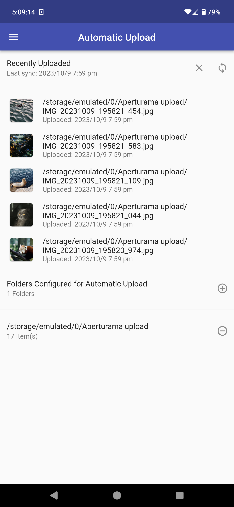

# Aperturama-Frontend

An app that helps you back up and sync your media to a server under your control. Written in Flutter and depends on the [backend server](https://github.com/Aperturama/Aperturama-Backend) for most functionality. 

# Example Screenshots
<style>
table th {
    width: 33%;
}
</style>
| Media View                                    | Collections View                                          | Auto Upload Settings                                    |
|-----------------------------------------------|-----------------------------------------------------------|---------------------------------------------------------|
|  |  |  |
  
# Build Information
Run these commands:
```
flutter pub get
flutter pub run flutter_launcher_icons:main
flutter pub pub run flutter_launcher_icons:main
flutter clean
flutter build apk --release
flutter build web --release
```

# Potential Future Improvements
- Collection cards as a grid (not implemented due to issues with height being equal to width and being unable to fix that)
- Global grid size (or one that gets saved/loaded to local storage and remembered across sessions)
- Photo and collection IDs in the URL for reloaded pages to work properly
- Ability to swipe left/right on photos to move to the next/previous
- Video support
- More animations (See https://docs.flutter.dev/cookbook/animation/page-route-animation, https://pub.dev/packages/simple_animations, https://flutter.github.io/samples/animations.html)
- A splash screen (https://docs.flutter.dev/development/ui/advanced/splash-screen)
- Proper looking name/app icon on Android (well, one that works reliably)
- Editing what media is in a collection could bring you back to the settings rather than the homepage
- Hide photos that are already in a collection from the add to collection view
- Web version should hide/autofill server URL
- Plurality fixes (collections vs collection)

# References Used:
- https://docs.flutter.dev/
- https://api.flutter.dev/
- https://stackoverflow.com/
- https://medium.flutterdevs.com/
